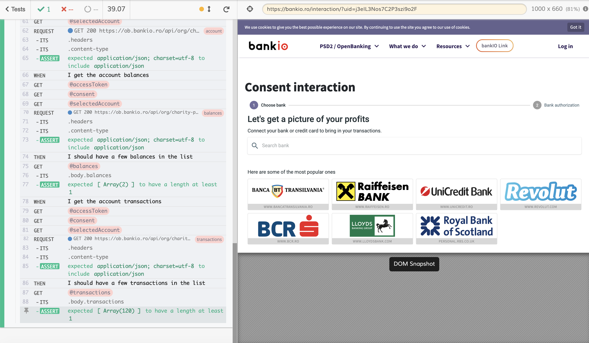

# bankIO cypress automated E2E PSD2/OpenBanking api tests

## Use

Install dependencies with `npm install` or `npm ci`

See scripts in `package.json` to start the local API server and run the tests. The main ones are

* `npm start` - runs the local API server
* `npm run cy:open` - runs Cypress in GUI mode
* `npm test` - starts the local API server and runs Cypress tests against it in headless mode

## Environment variables

* `client_id` - bankIO OpenID Connect client id
* `client_secret` - bankIO OpenID Connect client secret
* `organisation` - bankIO organisation name

## List of current ASPSPs

### AISP

* Lloyds bank (sandbox)
* Banca Transilvania (sandbox)
* Raiffeisen Bank Romania (sandbox)
* RBS Bank (sandbox)
* Banca Comercială Română (sandbox)
* Alpha Bank (sandbox)
* Monzo Bank (sandbox)
* Revolut Bank (sandbox)
* UniCredit Bank Romania (sandbox)
* Danske Bank (sandbox)
* ING Group (sandbox)

## Give us your feedback

Your feedback is important to us.

- To let us know about any questions or issues you find in the documentation, [submit an issue](https://github.com/bank-io/bankIO-cypress-api-testing/issues) in this repository.
- We also encourage you to fork, make the fix, and do a pull request of your proposed changes. See [CONTRIBUTING.md](CONTRIBUTING.md) for contributing guidelines.
- To let us know about your experience, what you would like to see in future versions, code samples, and so on, write your suggestions and ideas at [dev@bankio.co.uk](mailto:dev@bankio.co.uk).

## License

MIT License. Please see the [license file](https://github.com/bank-io/bankIO-cypress-api-testing/blob/master/LICENSE.md) for more information.

## About

Made in UK 🇬🇧 and Romania 🇷🇴 Europe 🇪🇺

[bankIO Link](https://bankio.co.uk/bankio-link/) is a PSD2/OpenBanking aggregator built by bankIO. bankIO builds data products and ecosystem solutions for bank and fintech providers.

## Disclaimer 

We do our best to ensure that the data we provide is complete, accurate and useful. However, because mistakes do happen, and because the processing required to make the data useful is complex, we cannot be liable for omissions or inaccuracies.

## Links

* [bankIO](https://bankio.co.uk/)
* [bankIO Link](https://bankio.co.uk/bankio-link/)
* [Facebook - bankIO](https://www.facebook.com/thisisbankio)
* [LinkedIn - bankIO](https://linkedin.com/company/bankio)